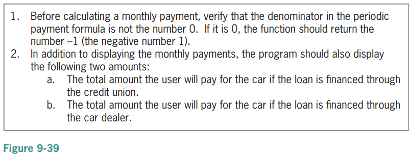

# These assignments directly correspond with assignments in your book. For further details and references, please refer to the approriate sections in your textbook, and if you need further clarification, please reach out.

# Lab 9-2 Plan and Create

1. **Read textbook pages 307 through 314. Note that your book gives instructions for setting up development tools and a development environment. Ignore those instructions. We are using Replit instead. Figure 9-34 on page 314 gives the final C++ instructions to be submitted. Please do not just copy and paste. Working through Lab 9-2 will get you used to developing, building, testing, and pushing/submitting your code**i

2. **Test the program using the same data used to desk-check the program. You can compile and run your code with the following commands:**
```
make clean
make lab9-2
./lab9-2
```
**You can also use the unit test for testing your code by running the following:** 
``` 
make test_lab9-2
./test_files/test_lab9-2
```

3. **When you are done, push your code to the Github classroom. A Github Action will grade your lab.**

# Homework 9-19

**In this exercise, you will modify the car payment program from Lab 9-2. Make the modifications listed in Figure 9-39. Test the program appropriately.**




```
make clean
make hw9-19
./hw9-19
```
**You can also use the unit test for testing your code by running the following:** 
``` 
make test_hw9-19
./test_files/test_hw9-19
```


# Lab 10-2 Plan and Create

1. **Read textbook pages 347 through 355. Note that your book gives instructions for setting up development tools and a development environment. Ignore those instructions. We are using Replit instead. Figure 10-22 on page 354 gives the final C++ instructions to be submitted. Please do not just copy and paste. Working through Lab 10-2 will get you used to developing, building, testing, and pushing/submitting your code**i

2. **Test the program using the same data used to desk-check the program. You can compile and run your code with the following commands:**
```
make clean
make lab10-2
./lab10-2
```
**You can also use the unit test for testing your code by running the following:** 
``` 
make test_lab10-2
./test_files/test_lab10-2
```

3. **When you are done, push your code to the Github classroom. A Github Action will grade your lab.**

# Homework 10-13

**In this exercise, you will modify the program from Lab 9-2 in Chapter 9. Copy the instructions from the Lab9-2.cpp file. (Alternatively, you can enter the instructions from Figure 9-34 into the ModifyThis13.cpp file.) Change the getPayment function to a void function. Test the program appropriately.**

```
make clean
make hw10-13
./hw10-13
```
**You can also use the unit test for testing your code by running the following:** 
``` 
make test_hw10-13
./test_files/test_hw10-13
```